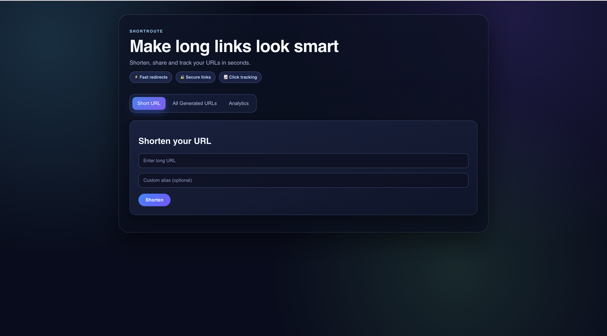
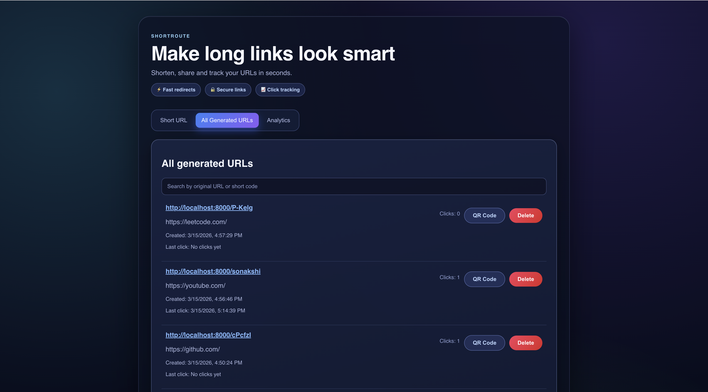
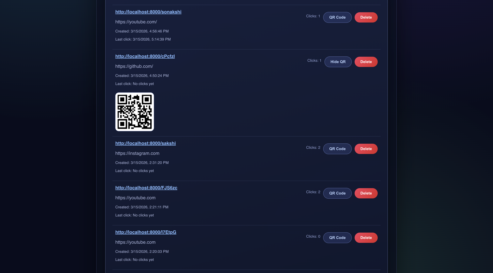
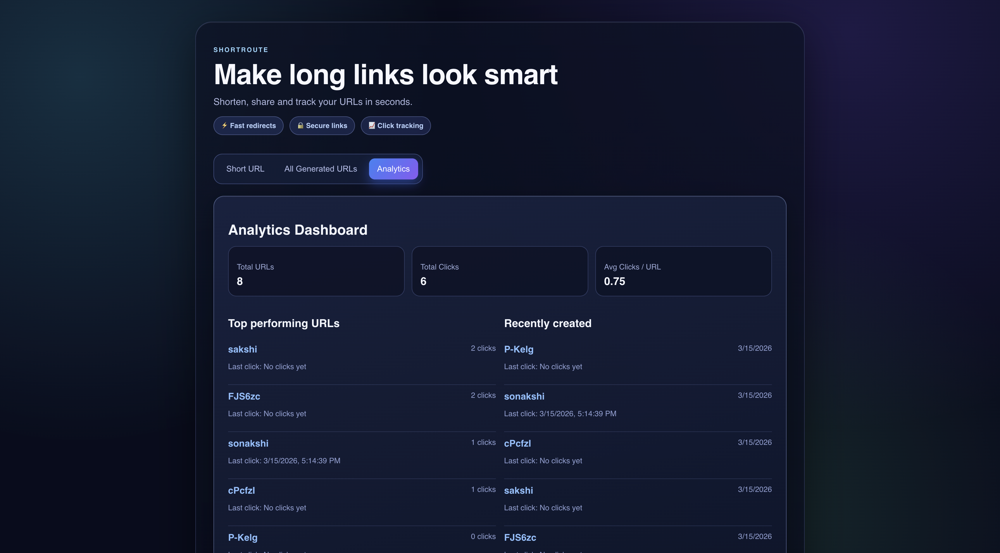

# 🔗 ShortRoute — Smart URL Shortener

ShortRoute is a full-stack URL shortening platform that allows users to convert long URLs into short, shareable links while tracking detailed analytics.

The system provides custom aliases, click tracking, QR code generation, and an analytics dashboard to monitor link performance.

---

# 🚀 Features

### 🔗 URL Shortening
- Convert long URLs into short links
- Custom alias support
- Fast redirect system

### 📊 Analytics Dashboard
- Total URLs created
- Total click count
- Average clicks per URL
- Top performing URLs
- Recently created links

### 📈 Click Tracking
- Track number of visits per URL
- Store click count in database
- Display performance metrics in dashboard

### 🔎 URL Management
- View all generated URLs
- Search URLs
- Delete URLs

### 📋 Copy & Share
- One-click copy button for shortened URLs
- QR code generation for easy sharing

### 🎨 Modern UI
- Responsive dashboard
- Tab-based navigation
- Clean card layout
- Interactive analytics section

---

# 🏗 System Architecture
User
↓
React Frontend (TypeScript + Vite)
↓
REST API (Node.js + Express)
↓
MongoDB Database
↓
URL Redirect Service

When a user visits a shortened URL:
Short URL → Backend → Lookup in database → Redirect to original URL

Click events are tracked and stored to power the analytics dashboard.

---

# 🛠 Tech Stack

## Frontend
- React
- TypeScript
- Vite
- CSS

## Backend
- Node.js
- Express.js

## Database
- MongoDB
- Mongoose ODM

## API Communication
- Axios

---

# 📸 Screenshots

Add screenshots of:

- 
- 
- 
- 

---

# 👩‍💻 Author

**Sakshi Gangwani**

Graduate Student — Computer Science  
University of Southern California

---

# ⭐ If you found this project useful

Give the repository a ⭐ on GitHub!